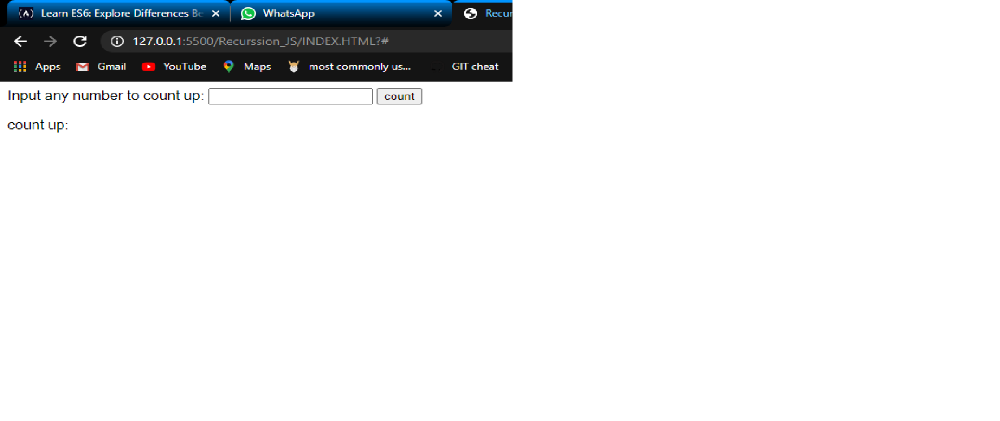

# RECURSION

> This code counts up to any number specified. (Javascript)

Additional description about the project and its features.

## Built With

- HTML & Javascript,

## Live Demo

[Live Demo Link](http://127.0.0.1:5500/Recurssion_JS/INDEX.HTML?#)

## Getting Started

**Modify this file to match your project, remove sections that don't apply.**

To get a local copy up and running follow these simple example steps.

### Prerequisites

### Setup

### Install

### Usage

### Run tests

### Deployment

## Authors

👤 **Author1**

- Github: [@githubhandle](https://github.com/SamuelOdimegwu)
- Linkedin: [linkedin](https://www.linkedin.com/in/samuel-odimegwu-0364291a8/)

## 🤝 Contributing

Contributions, issues and feature requests are welcome!

Feel free to check the [issues page](issues/).

## Show your support

Give a ⭐️ if you like this project!

## 📝 License

This project is [MIT](lic.url) licensed.
